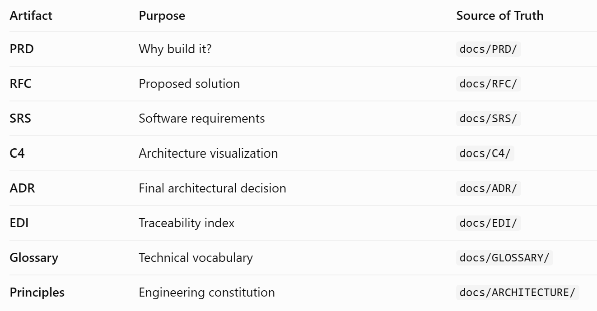

# AEGIS-ARCH-001

# Aegis Engineering Principles

Version: 1.0

Status: Active

Owner: Kader Beevi

Purpose: Define the engineering principles that guide every architectural decision, implementation, and operational practice within Aegis AI Platform.

> These principles act as the constitution of the project. Every RFC, ADR, design decision, and implementation should align with them.

---

# Core Philosophy

Aegis is built around one belief:

> **Reliable AI systems are engineered, not improvised.**

The platform prioritizes correctness, observability, scalability, and maintainability over unnecessary complexity.

---

# Principle 1 — Documentation First

Every significant feature begins with documentation before implementation.

Workflow:

PRD → RFC → SRS → C4 → ADR → Code → Tests

**Why**

- Clear requirements
- Better architecture discussions
- Easier maintenance

---

# Principle 2 — Reliability Over Cleverness

Simple, reliable systems are preferred over unnecessarily clever implementations.

Examples:

- Predictable APIs
- Explicit error handling
- Safe retries

---

# Principle 3 — Idempotency by Default

Operations should produce the same outcome when executed multiple times.

Examples:

- Membership updates
- Event processing
- Retry workflows

---

# Principle 4 — Event-Driven Thinking

Components communicate through events whenever appropriate.

Examples:

- Kafka
- Pub/Sub
- Service Bus

Benefits:

- Loose coupling
- Better scalability
- Easier evolution

---

# Principle 5 — Observability Is Built-In

Every service should be observable from day one.

Minimum requirements:

- Structured logging
- Metrics
- Distributed tracing
- Health endpoints

Technology:

- OpenTelemetry
- Prometheus
- Grafana

---

# Principle 6 — Security by Default

Security is part of the architecture.

Requirements:

- JWT authentication
- Least privilege
- Secret management
- Audit logging

---

# Principle 7 — AI Requires Evaluation

Every AI feature should be measurable.

Evaluation areas:

- Correctness
- Faithfulness
- Latency
- Tool success
- Hallucination rate

No AI feature is considered complete without evaluation.

---

# Principle 8 — Design for Failure

Failures are expected.

Every component should consider:

- retries
- timeouts
- circuit breakers
- graceful degradation

---

# Principle 9 — Cloud Neutral Architecture

The platform should avoid unnecessary cloud lock-in.

Primary environments:

- AWS
- Azure

Container-first deployment keeps services portable.

---

# Principle 10 — Test What Matters

Testing should focus on behavior.

Testing pyramid:

- Unit Tests
- Integration Tests
- End-to-End Tests
- AI Evaluations

Coverage should emphasize critical business behavior rather than percentages alone.

---

# Principle 11 — Decisions Must Be Traceable

Every important decision should be discoverable.

Artifacts:

- PRD
- RFC
- SRS
- C4
- ADR
- EDI

Future engineers should understand why a decision was made.

---

# Principle 12 — Build for Humans

Good engineering includes good developer experience.

Priorities:

- readable code
- clear documentation
- meaningful commit history
- consistent naming
- maintainable architecture

---

# Engineering Checklist

Before merging a feature, verify:

- [ ] PRD updated (if needed)
- [ ] RFC completed
- [ ] SRS updated
- [ ] C4 updated
- [ ] ADR recorded
- [ ] Tests added
- [ ] Observability included
- [ ] Documentation updated
- [ ] Commit history is meaningful

---

# Decision Hierarchy

When principles conflict, follow this order:

1. Security
2. Correctness
3. Reliability
4. Maintainability
5. Performance
6. Developer Experience

---

# Engineering Motto

> Build systems that future engineers will trust before they admire.

# Aegis Engineering Governance v1.0 (Final)
> One source of Truth for Every Engineering Artifact

>Every architectural decision must exist in one place only—the ADR.

PRINCIPLES (Constitution) → PRD → RFC → SRS → C4 → ADR → EDI → GitHub Issue → Commit → Pull Request → Tests → Deployment

## Provider Agnostic AI

Aegis treats Large Language Models as interchangeable infrastructure.

Business logic must never depend directly on a specific model provider.

Instead, all model interactions flow through a provider abstraction layer.

Benefits:

- Multi-provider support
- Easier testing
- Cost optimization
- Failover capability
- Vendor independence
