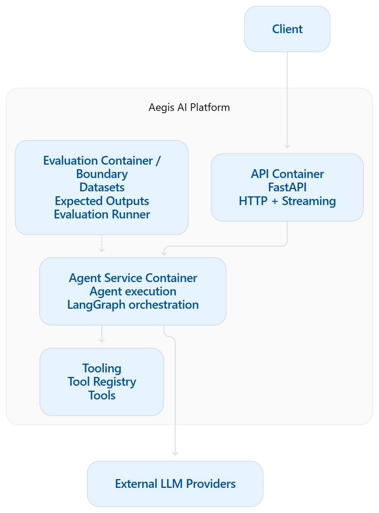
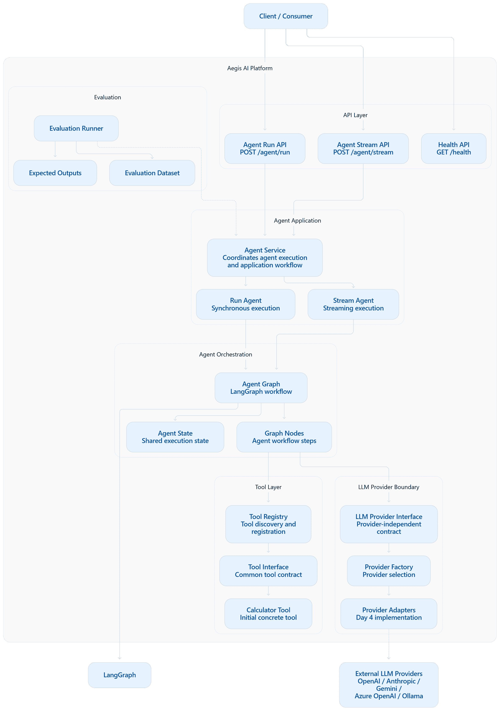
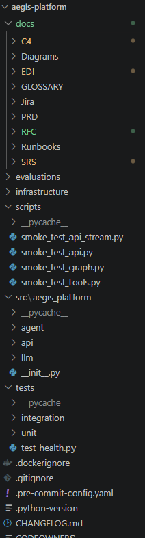

# AEGIS-C4-001
>Context Container Component Code - This documentation talks about the architecture review.How is it structured?

>Context - System Boundaries, Container - Application Building blocks.
# C4 Architecture – Level 1 & Level 2  & Level 3 & Level 4

**Version:** 1.3
**Status:** Active
**Owner:** Kader Beevi
**Last Updated:** 2026-09-29

## Related Artifacts

- PRD: AEGIS-PRD-001
- RFC-001: Platform Foundation
- RFC-002: FastAPI Foundation
- SRS: AEGIS-SRS-001
- ADR: AEGIS-ADR-001
- EDI: AEGIS-EDI-001

---

# Revision History

| Version | Date | Changes |
|----------|------|---------|
| 1.0 | 2026-09-27 | Initial platform architecture. |
| 1.1 | 2026-09-28 | Added FastAPI Gateway as the primary API entry point. |
| 1.2 | 2026-09-29 | Added LangGraph orchestration layer. |

---

# Purpose

This document describes the high-level architecture of Aegis AI Platform using the C4 Model.

Current implementation focuses on:

- FastAPI Gateway
- Python foundation
- Future AI services

---

# Level 1 — System Context

## Actors

- End User
- Administrator
- Future AI Client
- External LLM Providers (Future)

## Context Diagram

```text
                 +----------------------+
                 |      End User        |
                 +----------+-----------+
                            |
                            v
        +-------------------------------------------+
        |         Aegis AI Platform                  |
        |-------------------------------------------|
        | FastAPI Gateway                           |
        | AI Agent Platform                         |
        | Observability                             |
        | Future Event Processing                   |
        +----------------+--------------------------+
                         |
         +---------------+---------------+
         |                               |
         v                               v
+------------------+           +----------------------+
| Future LLM APIs  |           | Future Vector DB     |
| (OpenAI, etc.)   |           | (Qdrant)             |
+------------------+           +----------------------+
```

---

# Level 2 — Container Diagram

The platform is organized into independently deployable containers.



---

# Container Responsibilities

| Container | Responsibility |
|------------|---------------|
| FastAPI Gateway | Entry point, validation, OpenAPI, health endpoints |
| Agent Service | LangGraph orchestration (future) |
| Retriever | RAG retrieval (future) |
| Evaluation | AI evaluation (future) |
| PostgreSQL | Metadata storage (future) |
| Qdrant | Vector search (future) |

---

# Level 3 - Component Diagram



Current Architecture — Simplified View

```text
                         ┌──────────────────────┐
                         │       Client         │
                         └──────────┬───────────┘
                                    │
                     ┌──────────────┴──────────────┐
                     │                             │
                     ▼                             ▼
              /agent/run                   /agent/stream
                     │                             │
                     └──────────────┬──────────────┘
                                    │
                                    ▼
                         ┌──────────────────────┐
                         │    Agent Service     │
                         └──────────┬───────────┘
                                    │
                         ┌──────────┴──────────┐
                         │                     │
                         ▼                     ▼
                  Run Agent              Stream Agent
                         │                     │
                         └──────────┬──────────┘
                                    │
                                    ▼
                         ┌──────────────────────┐
                         │    Agent Graph       │
                         │      LangGraph       │
                         └──────────┬───────────┘
                                    │
                       ┌────────────┼────────────┐
                       │            │            │
                       ▼            ▼            ▼
                  Agent State   Graph Nodes   Tool Registry
                                                  │
                                                  ▼
                                           Tool Interface
                                                  │
                                                  ▼
                                           Calculator Tool


                                    │
                                    ▼
                         ┌──────────────────────┐
                         │  LLM Provider Layer  │
                         │      (Boundary)      │
                         └──────────┬───────────┘
                                    │
                                    ▼
                              Provider Factory
                                    │
                                    ▼
                            Provider Adapters
                                    │
                   ┌────────────────┼────────────────┐
                   │                │                │
                   ▼                ▼                ▼
                OpenAI          Anthropic         Gemini
              (future/Day 4)   (future/Day 4)   (future/Day 4)


                         ┌──────────────────────┐
                         │     Evaluation       │
                         ├──────────────────────┤
                         │ Evaluation Dataset   │
                         │ Expected Outputs     │
                         │ Evaluation Runner    │
                         └──────────────────────┘

```

---

# Level 4 - Code Tree




---

# Current Implementation Scope

The following components are implemented during EPIC-002:

- FastAPI Gateway
- Health endpoints
- OpenAPI documentation
- Local development foundation

Future containers remain planned until their respective RFCs are implemented.

---

# Architecture Principles

This architecture follows:

- Documentation First
- Event-Driven Thinking
- Observability Built In
- Cloud Neutral Architecture
- Reliability Over Cleverness

These principles are defined in `docs/ARCHITECTURE/PRINCIPLES.md`.

---

# Traceability

| Artifact | Purpose |
|----------|---------|
| RFC-002 | FastAPI proposal |
| ADR-001 | FastAPI decision |
| SRS-001 | Software requirements |
| EDI-001 | Decision traceability |
| EPIC-002 | Implementation |
